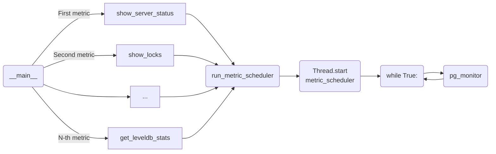

# sqreamdb-monitor-service


Python implementation of Sqreamdb monitor service.

## How to configure project

Python version: 3.9

1. Create virtual environment
```commandline
python3.9 -m venv .venv
```

2. Activate virtual environment
```commandline
. .venv/bin/activate
```

3. Install requirements 
```commandline
pip install -r requirements.txt
```

## How to trigger Monitor service:
1. Start monitor worker (no-GPU resource):
  * cd <PACKAGE>
  * bin/metadata_server
  * bin/sqreamd <CLUSTER> 0 5000 ~/.sqream/license.enc -config <MONITOR_SERVICE_CLONE>/config_files/sqream_config.json &

2. Trigger Monitor Service:
  * cd <MONITOR_SERVICE_CLONE>
  * python3.9 monitor_service.py


## Graph (for better understanding what's happening)




## Next steps

1) Expansion: add utility functions scrapping `show_cluster_nodes`, `get_license_info`
2) Store information in Prometheus instead of postgres
3) Integrate monitor service with TI alike