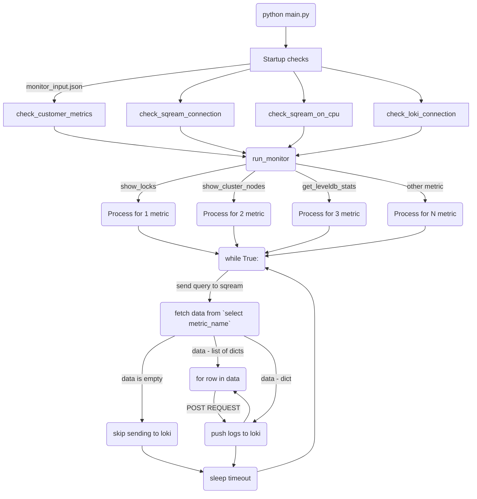

# SqreamDB Monitor Service


Python implementation of SQreamDB monitor service.

Python version: 3.9

Also, you need to be installed:
* [Grafana](https://roman-academy.medium.com/how-to-install-and-configure-grafana-on-centos-7-56c28dc04840)
* [Loki](https://grafana.com/docs/loki/latest/setup/install/)

## How to configure project environment

1. Create virtual environment

    ```commandline
    python3.9 -m venv .venv
    ```

2. Activate virtual environment

    ```commandline
    . .venv/bin/activate
    ```

3. Install requirements

    ```commandline
    pip install -r requirements.txt
    ```
   
4. Run tests
   
   ```commandline
   pytest -v
   ```

## How to trigger Monitor service

### 1. Start monitor worker (no-GPU resource)

`sqream_config.json`

```json
{
    "cudaMemQuota":0,
    "gpu": 0,
    "legacyConfigFilePath": "sqream_config_legacy.json",
    "metadataServerIp": "127.0.0.1",
    "metadataServerPort": 3105,
    "port": 5000,
    "useConfigIP": true,
    "limitQueryMemoryGB" : 8,
    "initialSubscribedServices": "monitor"
}
```

`sqream_config_legacy.json`

```json
{
    "debugNetworkSession": false,
    "developerMode": true,
    "diskSpaceMinFreePercent": 1,
    "enableLogDebug": true,
    "insertCompressors": 8,
    "insertParsers": 8,
    "nodeInfoLoggingSec": 0,
    "reextentUse": false,
    "showFullExceptionInfo": true,
    "showInternalExceptionInfo": false,
    "useClientLog": true,
    "useMetadataServer": true,
    "spoolMemoryGB" : 4,
    "clientReconnectionTimeout": 10000,
    "liveConnectionThreshold": 100000
}
```

1) Go to sqream package directory

    ```commandline
    cd <sqream_package_dir>
    ```

2) Run metadata_server in background

    ```commandline
    bin/metadata_server &
    ```

3) Run sqreamd worker in background

    ```commandline
    bin/sqreamd -config <monitor_service_root_dir>/config_files/sqream_config.json &
    ```

### 2. Run Monitor Service

1) Go to monitor service root directory

    ```commandline
    cd <monitor_service_root_dir>
    ```

2) Configure `monitor_input.json` if you need

    Numbers here are timeouts for monitor metric processes to send `select <metric_name>();` query

    ```json
    {
      "show_server_status": 7,
      "show_locks": 2,
      "get_leveldb_stats": 5,
      "show_cluster_nodes": 4,
      "get_license_info": 5
    }
    ```

3) Run monitor service

    ```commandline
    python main.py
    ```

## Monitor service command-line interface

> All arguments below are optional and could be a `flag` or an `option`\
> If argument is a `flag` you need to provide value, like: `--host=127.0.0.1` or `--host 192.168.0.1`\
> If argument is an `option` you just need to put its name, and it will be True otherwise False\
> For example if you put `option` `-h` or `--help` it will be recognized as `True` if you don't do it - `False`


| #  | view              | type    | description                        | default     |
|----|-------------------|---------|------------------------------------|-------------|
| 1  | `-h` `--help`     | option  | show help message                  | `-`         |
| 2  | `--host`          | string  | Sqream host address                | `localhost` |
| 3  | `--port`          | integer | Sqream port                        | `5000`      |
| 4  | `--database`      | string  | Sqream database name               | `master`    |
| 5  | `--user`          | string  | Sqream username                    | `sqream`    |
| 6  | `--password`      | string  | Sqream password                    | `sqream`    |
| 7  | `--clustered`     | option  | Option if server_picker is running | `False`     |
| 8  | `--service`       | string  | Sqream service name                | `monitor`   |
| 9  | `--loki_host`     | string  | Loki instance host address         | `localhost` |
| 10 | `--loki_port`     | integer | Loki instance port                 | `3100`      |
| 11 | `--log_file_path` | string  | Path to file to store logs         | `None`      |


## Graph



## Useful links

* [SQreamDB documentation](https://docs.sqream.com/en/latest/)
* [Grafana installation guide](https://roman-academy.medium.com/how-to-install-and-configure-grafana-on-centos-7-56c28dc04840)
* [Loki installation guide](https://grafana.com/docs/loki/latest/setup/install/)
