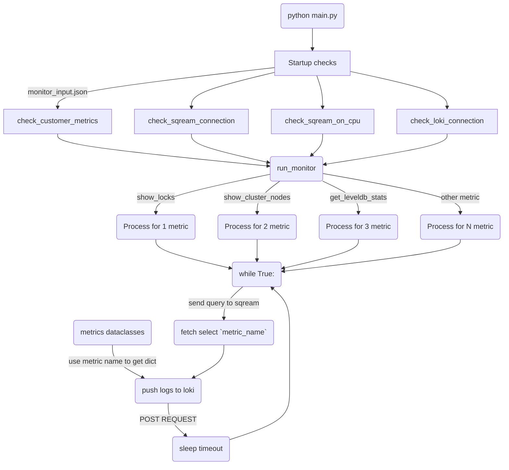

# sqreamdb-monitor-service


Python implementation of SQreamDB monitor service.

## How to configure project environment

Python version: 3.9

1. Create virtual environment

    ```commandline
    python3.9 -m venv .venv
    ```

2. Activate virtual environment

    ```commandline
    . .venv/bin/activate
    ```

3. Install requirements

    ```commandline
    pip install -r requirements.txt
    ```
   
4. Run tests
   
   ```commandline
   pytest -v
   ```

## How to trigger Monitor service

### 1. Start monitor worker (no-GPU resource)

`sqream_config.json`

```json
{
    "cudaMemQuota":0,
    "gpu": 0,
    "legacyConfigFilePath": "sqream_config_legacy.json",
    "metadataServerIp": "127.0.0.1",
    "metadataServerPort": 3105,
    "port": 5000,
    "useConfigIP": true,
    "limitQueryMemoryGB" : 8,
    "initialSubscribedServices": "monitor"
}
```

`sqream_config_legacy.json`

```json
{
    "debugNetworkSession": false,
    "developerMode": true,
    "diskSpaceMinFreePercent": 1,
    "enableLogDebug": true,
    "insertCompressors": 8,
    "insertParsers": 8,
    "nodeInfoLoggingSec": 0,
    "reextentUse": false,
    "showFullExceptionInfo": true,
    "showInternalExceptionInfo": false,
    "useClientLog": true,
    "useMetadataServer": true,
    "spoolMemoryGB" : 4,
    "clientReconnectionTimeout": 10000,
    "liveConnectionThreshold": 100000
}
```

1) Go to sqream package directory

    ```commandline
    cd <sqream_package_dir>
    ```

2) Run metadata_server in background

    ```commandline
    bin/metadata_server &
    ```

3) Run sqreamd worker in background

    ```commandline
    bin/sqreamd -config <monitor_service_root_dir>/config_files/sqream_config.json &
    ```

### 2. Run Monitor Service

1) Go to monitor service root directory

    ```commandline
    cd <monitor_service_root_dir>
    ```

2) Configure `monitor_input.json` if you need

    Numbers here are timeouts for monitor metric processes to send `select <metric_name>();` query

    ```json
    {
      "show_server_status": 7,
      "show_locks": 2,
      "get_leveldb_stats": 5,
      "show_cluster_nodes": 4,
      "get_license_info": 5
    }
    ```

3) Run monitor service

    ```commandline
    python main.py
    ```

## Graph (WILL BE REFACTORED LATER)



## Useful links

* [SQreamDB documentation](https://docs.sqream.com/en/latest/)