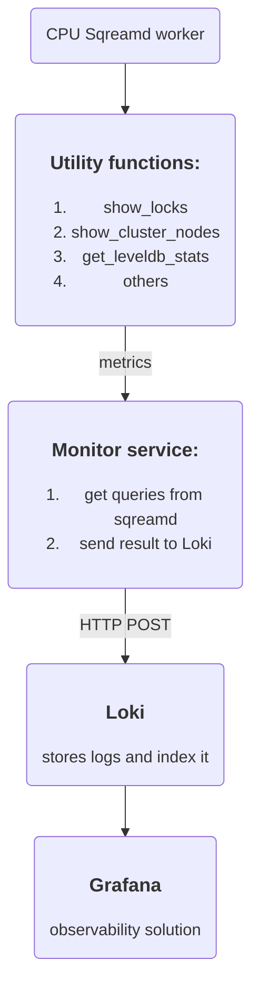
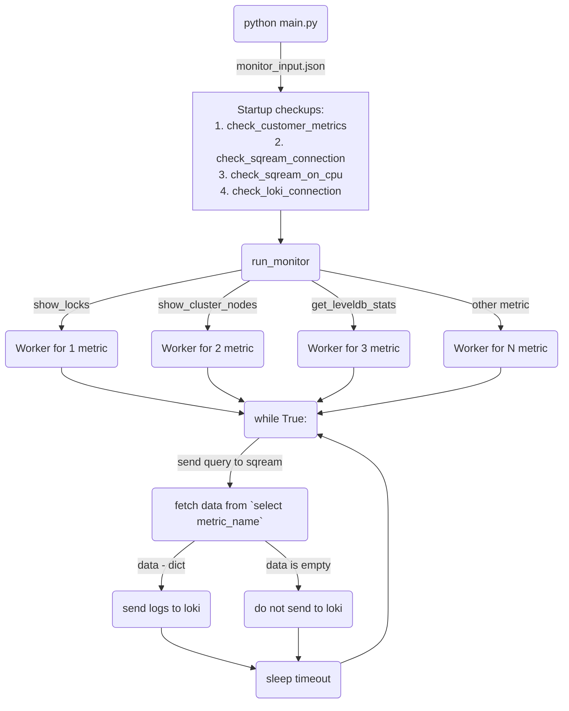

# SqreamDB Monitor Service


## Contents

1. [Overview](#1-overview)
   1. [Description](#11-description)
   2. [Quick start](#12-quick-start)
   3. [Requirements](#13-requirements)
   4. [Architecture](#14-architecture)
2. [Configuration](#2-configuration)
   1. [Configure sqream non-GPU worker](#21-configure-sqream-non-gpu-worker)
   2. [Configure project environment](#22-configure-monitor-service)
3. [Monitor service command-line arguments reference](#3-monitor-service-command-line-arguments-reference)
4. [Service working cycle graph](#4-service-execution-plan-graph)
5. [Useful links](#5-useful-links)

## 1. Overview

### 1.1 Description

Monitor service was developed as a part of [RCA (Root Cause Analysis)](https://sqream.atlassian.net/wiki/spaces/PRODUCT/pages/2962784261/SQDB+Root+Cause+Analysis+PRD) 
for observe customer's sqream infrastructure\
In general, monitor service sends utility function queries to sqream <u>CPU worker</u>, get results and push them to <u>loki instance</u>.\
Data from Loki can be obtained and used by any observability systems (such as [Grafana](https://grafana.com/)) 
to catch an errors, unexpected behaviors or something else.

**Flow example:**

1. First of all, after you ran monitor service, it sends utility function query to sqream instance:
    
    ```sql
    select utility_function_example();
    ```

    which returns something like:

    ```
    | number | worker name | worker value |
    | 1      | foo         | 5            |
    | 2      | bar         | 2            |
                    . . .
    | N      | span        | 10           |
    ```

2. When result was fetched, monitor service convert it into array with mappings, like:

    ```
    [
        { "number": 1, "worker_name": "foo", "worker_value": 5 }
        { "number": 2, "worker_name": "bar", "worker_value": 2 }
                           .    .   .   .   .
        { "number": N, "worker_name": "span", "worker_value": 10 }
    ]
    ```

3. Finally, monitor service push data to loki via `HTTP POST request` (`request` library in python):

    ```
    curl -X POST -H "Content-Type: application/json" "http://localhost:3100/loki/api/v1/push" --data-raw \
        '{"streams": [{ "stream": { "metric_name": "utility_function_example" }, "values": [ [ "1570818238000000000", { "number": 1, "worker_name": "foo", "worker_value": 5 } ] ] }]}'    
    ```

### 1.2 Quick start

> [!NOTE] 
> All flags will be presented at [command-line arguments reference](#3-monitor-service-command-line-arguments-reference) 

```commandline
python main.py  --host=127.0.0.1 --port=5000 --database=master --username=sqream --password=sqream --service=monitor --loki_host=127.0.0.1 --loki_port=3100
```

### 1.3 Requirements

* Python version: 3.9
* [Sqream CPU instance](#21-configure-sqream-non-gpu-worker)
* [Pip's requirements](./requirements.txt)
* [Loki](https://grafana.com/docs/loki/latest/setup/install/)

### 1.4 Architecture

Here is a simple representation of monitor service components



## 2. Configuration

### 2.1 Configure sqream non-GPU worker

> [!IMPORTANT]
> Don't forget to change `cluster` and `licensePath` fields in the `sqream_config.json` configuration file

Example of `sqream_config.json`

```json
{
    "cluster": "path/to/your/cluster/",
    "licensePath": "path/to/your/license.enc",
    "cudaMemQuota":0,
    "gpu": 0,
    "legacyConfigFilePath": "sqream_config_legacy.json",
    "metadataServerIp": "127.0.0.1",
    "metadataServerPort": 3105,
    "port": 5000,
    "useConfigIP": true,
    "limitQueryMemoryGB" : 8,
    "initialSubscribedServices": "monitor"
}
```

Example of `sqream_config_legacy.json`

```json
{
    "debugNetworkSession": false,
    "developerMode": true,
    "diskSpaceMinFreePercent": 1,
    "enableLogDebug": true,
    "insertCompressors": 8,
    "insertParsers": 8,
    "nodeInfoLoggingSec": 0,
    "reextentUse": false,
    "showFullExceptionInfo": true,
    "showInternalExceptionInfo": false,
    "useClientLog": true,
    "useMetadataServer": true,
    "spoolMemoryGB" : 4,
    "clientReconnectionTimeout": 10000,
    "liveConnectionThreshold": 100000
}
```

1) Go to sqream package directory

    ```commandline
    cd sqream/package/dir
    ```

2) Run metadata_server in background

    ```commandline
    ./bin/metadata_server &
    ```

3) Run sqreamd worker in background

    ```commandline
    ./bin/sqreamd -config path/to/sqreamdb-monitor-service/config_files/sqream_config.json &
    ```


### 2.2 Configure monitor service

1. Clone git repository
   
   ```commandline
   git clone git@github.com:SQream/sqreamdb-monitor-service.git   
   ```

2. Go to cloned project directory

   ```commandline
   cd sqreamdb-monitor-service
   ```

3. Create virtual environment

    ```commandline
    python3.9 -m venv .venv
    ```

4. Activate virtual environment

    ```commandline
    source .venv/bin/activate
    ```

5. Install requirements

    ```commandline
    pip install -r requirements.txt
    ```
   
6. Run tests
   
> [!WARNING] 
> Full test coverage of monitor service will be presented at [Testing Framework](https://github.com/SQream/testing_framework/tree/michaelr-monitor-service/integration_test/tests/functionality/suites/mbb/scripts)\
> Cases here from [tests](tests/test_utils.py) created without any test plan only for utility functions
   
   ```commandline
   pytest -v
   ```
   
7. Configure `monitor_input.json` if you need

    Numbers here are timeouts - frequency for monitor to send `select <metric_name>();` query
    It should be non-negative and greater than zero 

    ```json
    {
      "show_server_status": 7,
      "show_locks": 2,
      "get_leveldb_stats": 5,
      "show_cluster_nodes": 4,
      "get_license_info": 5,
      "reset_leveldb_stats": 86400
    }
    ```

8. Run monitor service

    ```commandline
    python main.py --username=sqream --password=sqream
    ```

## 3. Monitor service command-line arguments reference

> All arguments below are optional and could be a `flag` or an `option`\
> If argument is a `flag` you need to provide value, like: `--host=127.0.0.1` or `--host 192.168.0.1`\
> If argument is an `option` you just need to put its name, and it will be True otherwise False\
> For example if you put `option` `-h` or `--help` it will be recognized as `True` if you don't do it - `False`


| #  | view              | required | type    | description                        | default     |
|----|-------------------|----------|---------|------------------------------------|-------------|
| 1  | `-h` `--help`     |          | option  | show help message                  | `-`         |
| 2  | `--host`          |          | string  | Sqream host address                | `localhost` |
| 3  | `--port`          |          | integer | Sqream port                        | `5000`      |
| 4  | `--database`      |          | string  | Sqream database name               | `master`    |
| 5  | `--username`      | ✅        | string  | Sqream username                    | `sqream`    |
| 6  | `--password`      | ✅        | string  | Sqream password                    | `sqream`    |
| 7  | `--clustered`     |          | option  | Option if server_picker is running | `False`     |
| 8  | `--service`       |          | string  | Sqream service name                | `monitor`   |
| 9  | `--loki_host`     |          | string  | Loki instance host address         | `localhost` |
| 10 | `--loki_port`     |          | integer | Loki instance port                 | `3100`      |
| 11 | `--log_file_path` |          | string  | Path to file to store logs         | `None`      |


## 4. Service execution plan graph



## 5. Useful links

* [Root Cause Analysis](https://sqream.atlassian.net/wiki/spaces/PRODUCT/pages/2962784261/SQDB+Root+Cause+Analysis+PRD)
* [SQreamDB documentation](https://docs.sqream.com/en/latest/)
* [Grafana installation guide](https://roman-academy.medium.com/how-to-install-and-configure-grafana-on-centos-7-56c28dc04840)
* [Loki installation guide](https://grafana.com/docs/loki/latest/setup/install/)
